# Business Entity Resolution — MLC 2026

For every **Source 1** business (the deduplicated reference), find all records in **Source 2** and **Source 3** that describe the same business. There are no shared IDs; names and addresses are noisy (abbreviations, typos, transliterations, Indic scripts, reordered addresses). The score is **F0.5 computed per Source 1 record and averaged**, singletons included, so a false match costs about 4× a missed one. Training data covers the US and India; test adds **France**, which never appears in training.

Problem statement: [`problem_statement.pdf`](problem_statement.pdf). How to run: [`code/business_entity_resolution/README.md`](code/business_entity_resolution/README.md).

## System architecture

```mermaid
flowchart LR
    subgraph IN["Input (one split)"]
        S1["Source 1<br/>reference"]
        T["Source 2 + 3<br/>targets"]
    end
    subgraph NORM["1 · Normalise"]
        N["anyascii + learned<br/>native-script dictionary<br/><i>translit.py, normalize.py</i>"]
    end
    subgraph BLK["2 · Blocking (per country)"]
        B1["address TF-IDF<br/>top-20"]
        B2["name+address TF-IDF<br/>top-30"]
        BU["union ≈ 38 / S1<br/>max 50"]
    end
    subgraph FEAT["3 · Pair features"]
        F["37 features: RapidFuzz,<br/>TF-IDF cosines, IDF coverage,<br/>house numbers, duplicates, hubs<br/><i>features.py</i>"]
    end
    subgraph MATCH["4 · Matcher (match.py)"]
        M1["Stage 1 LightGBM<br/>pair probability"]
        CE["Cross-encoder mDeBERTa-v3<br/>uncertain pairs only<br/><i>cross_encoder.py</i> (pending)"]
        M2["Stage 2 LightGBM<br/>+ list & competition context"]
    end
    subgraph DEC["5 · Decide"]
        A["one Source 1 per target<br/>+ caps S2≤5, S3≤6"]
        D["expected-F0.5 decoding<br/>per Source 1 (k=0 → singleton)"]
    end
    S1 & T --> N --> B1 & B2 --> BU --> F --> M1 --> M2
    M1 -. "0.02 ≤ p ≤ 0.98" .-> CE -. score .-> M2
    M2 --> A --> D
    BU ==> OUT1[["candidate_pairs.tsv"]]
    D ==> OUT2[["matching_results.tsv"]]
```



| Stage | What it does | Why (measured) |
|---|---|---|
| Normalise | Transliterates to ASCII; Indic-script words go through a **dictionary learned from `local_train` pairs** | Native-script words come from a closed 1,537-word vocabulary; the dictionary makes 88% of native names *identical* to the Source 1 name (off-the-shelf transliterators: ≤0.4%) |
| Blocking | Two TF-IDF top-K passes **within the same country**, IDF learned per country from the split itself | Matches never cross countries; country is compared as a string, so France needs no special code |
| Features | 37 string / rarity / number / structure features per pair | Source 1 is perfectly clean and all noise is on the target side, so similarity is measured in both directions |
| Stage 1 | LightGBM scores each pair on its own | – |
| Stage 2 | LightGBM adds each pair's rank in its Source 1 list and its margin over the best *competing* Source 1 for the same target | Candidates compete; the target-side margin carries most of stage 2's gain (+0.0027 F0.5) |
| Assign | Each target goes only to its highest-probability Source 1 | Every S2/S3 record matches at most one Source 1 (7.64M pairs = 7.64M distinct targets in train) |
| Decode | Per Source 1, keeps the k candidates that maximise *expected* F0.5 (k = 0 predicts "no match") | Optimal for a per-record F-measure; catches singletons |

## Data splits

All splits use the same file layout (`<split>_source{1,2,3}.tsv` + `<split>_ground_truth.tsv`), so every stage runs on any of them with `--split <name>`. Built by `src/data_loader.py`; assignment is a seeded hash of the entity ID, so it is reproducible.

| Split | Source 1 | Targets | Built as | Used for | Results |
|---|---|---|---|---|---|
| `train` | 2,206,821 | 10,320,219 | Official, labelled | Source of all local splits | – |
| `test` | 1,732,544 | 9,969,589 | Official, no labels (15% France) | Submissions | 65.2M candidate pairs; see submissions below |
| `local_train` | 1,985,796 | 9,286,116 | 90% of train Source 1 + their matched targets + 90% of unmatched targets | **Native-script dictionary** (`cache/translit.json`); target pool for `ce_train` and `scale_val` | – |
| `local_val` | 221,025 | 1,034,103 | The other 10%: a closed universe, ~9× smaller than test | Blocking development; **matcher v2 training** (2-fold cross-fit, then final fit) → models used for submissions 1–4 | Blocking keeps 98.8% of true pairs (F0.5 ceiling 0.996); matcher cross-fit **F0.5 0.9858** |
| `ce_train` | 99,050 | 9,286,116 (all `local_train`) | 5% of `local_train` Source 1 against **all** `local_train` targets | **Cross-encoder training** (hard negatives from test-sized crowding); disjoint from `local_val`, `scale_val` and test | Pending (Kaggle T4) |
| `scale_val` | 377,423 | 9,286,116 (all `local_train`) | 20% of `local_train` Source 1 (excluding `ce_train`'s) against **all** `local_train` targets | **Matcher retraining at test scale**; blocking recall at test scale | ⏳ in progress (Sat 26 Sep) |

**Why `scale_val` exists.** `local_val`'s cross-fit score (0.986) did not carry over to the leaderboard (US/India ≈ 0.944). `local_val` is a ~9× smaller universe, so its candidates are much less alike than test's: median address TF-IDF cosine is 0.32 vs 0.46 on test, and the IDF-independent address token-set ratio 0.57 vs 0.72. On test, 4.55% of pairs are uncertain against 1.06% on `local_val`. `scale_val` gives the matcher test-sized crowding with labels. Details: [`docs/PIPELINE.md` §4b](code/business_entity_resolution/docs/PIPELINE.md).

## Models

| Model | Licence | Trained on | Used in | Status |
|---|---|---|---|---|
| Native-script dictionary (word → Latin word) | – (our data) | `local_train` true pairs | Normalisation for every split | ✅ used in all submissions |
| TF-IDF blocking | – (unsupervised) | IDF from each split's own records (the only use of test inputs; no labels) | Blocking | ✅ |
| LightGBM stage 1 + stage 2 (v2) | MIT | `local_val` (8.3M pairs) | Submissions 1–4 | ✅ |
| LightGBM stage 1 + stage 2 (scale) | MIT | `scale_val` | Next submission | ⏳ training |
| `microsoft/mdeberta-v3-base` cross-encoder, listwise loss per Source 1 | MIT | `ce_train` | Stage-2 feature on uncertain pairs | ⏳ code done, GPU run pending |

All models are MIT/Apache and far below the 8B-parameter limit.

## Leaderboard submissions

| # | Model (trained on) | Decoding | Public F0.5 | Notes |
|---|---|---|---|---|
| 1 | LightGBM v2 (`local_val`) | expected-F0.5, shift 0 | **0.933414** | 5,900,990 matches |
| 2 | Same as 1, France rows blank | – | 0.809967 | Probe: US/India ≈ 0.944, France ≈ 0.874 |
| 3 | Same as 1 | shift −0.5 | pending | `output/test/matching_results_shift-0.50.tsv` |
| 4 | Same as 1 | shift −1.0 | pending | `output/test/matching_results_shift-1.00.tsv` |
| 5 | LightGBM (`scale_val`) | chosen on `scale_val` | planned | – |

## Repository layout

```
README.md                       this file: architecture, splits, models, results
problem_statement.pdf           the challenge
Documentation_template.md       methodology template (filled in for the final package)
utils/validate_submission.py    official submission validator
research/                       background: literature review, model notes, first EDA
code/business_entity_resolution/
    README.md                   how to set up and run (local and Kaggle/Colab)
    src/                        pipeline: data_loader, translit, normalize, blocking,
                                features, match, cross_encoder, evaluate, error_analysis
    scripts/                    run_pipeline.sh (one command), mem_guard.sh, cloud setup/packing
    notebooks/                  Kaggle/Colab runner, cross-encoder training notebook
    experiments/                one-off experiments referenced by docs/REPORT.md
    tests/                      scorer and matcher tests
    docs/                       see below
```

| Document | Contents |
|---|---|
| [`docs/PIPELINE.md`](code/business_entity_resolution/docs/PIPELINE.md) | Living status: stages, contracts, results, decisions, task board, submission log |
| [`docs/REPORT.md`](code/business_entity_resolution/docs/REPORT.md) | History and experiments (blocking runs A–D, what is verified) |
| [`docs/FINDINGS.md`](code/business_entity_resolution/docs/FINDINGS.md) | Measured data facts, metric analysis, model research |
| [`docs/ENSEMBLE.md`](code/business_entity_resolution/docs/ENSEMBLE.md) | Ensemble design and its rules |
| [`docs/ACCURACY_PLAN.md`](code/business_entity_resolution/docs/ACCURACY_PLAN.md) | Ranked plan to close the leaderboard gap, with decisions |

Generated data (`dataset/`, `cache/`, `output/`) is git-ignored.
